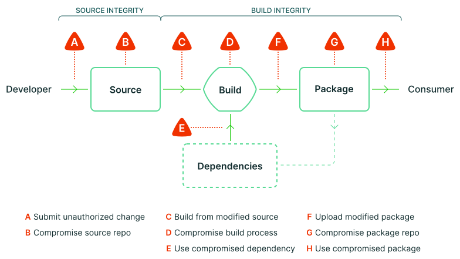

#   Secure Supply Chain Demo

This repository contains configuration to build a simple kubernetes platform that implements a secure software supply chain based on the [Supply chain Level for Software Artifact (SLSA)](https://slsa.dev/) framework.

The platform setup guide is [here](platform/README.md).

##  Source Integrity

The supply chain begins with a commit to an application's repository.

The platform is made aware of an application's repository through an out-of-scope onboarding process that results in the creation of:

1.  A git repository for the application's source code
1.  A read-only SSH deploy key to access the git repository
1.  PGP keys for the authors of the application's source code
1.  A subdirectory in this repository under the `gitops` directory

The `gitops` root directory is watched by a a Flux `Kustomization` that automatically synchronizes any changes to subdirectories to the platform.

For each subdirectory (i.e.: application), Flux automatically creates:

1.  A namespace for the application
1.  A Flux `GitRepository` in the application's namespace that watches for changes in the application's repository

Threats "A: Submit unauthorized change" and "B: compromise source repo" are mitigated at this point because:
1.  Unauthorized changes can be committed, but only commits signed with the PGP keys produced during onboarding will result in the `GitRepository` being in a healthy state. For purposes of this demonstration, we can assume two-person review occurred.
1.  The source repo is protected by a SOPS/PGP-encrypted SSH key, and hosted on GitHub. Only users with access to the `flux-system` namespace have access the decryption key. The `flux-system` namespace has been secured according to Flux's [Multi-tenancy Lockdown](https://fluxcd.io/flux/installation/#multi-tenancy-lockdown) guidance.